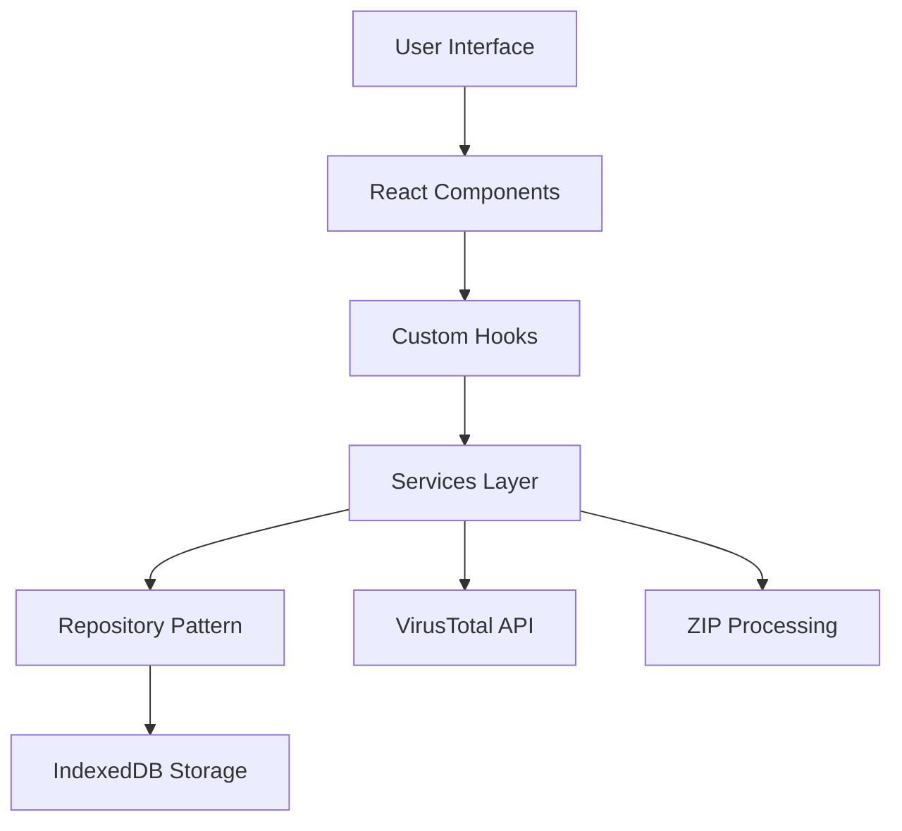
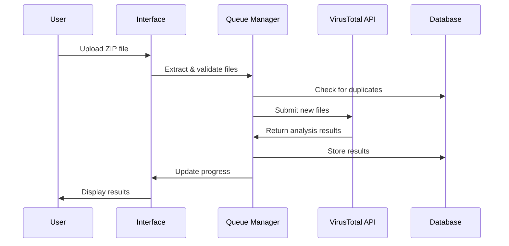
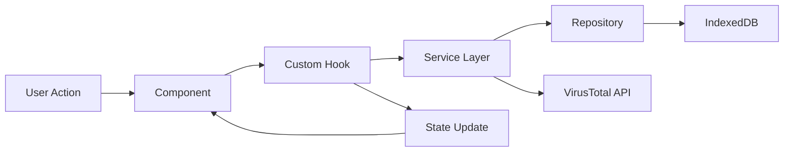

# 🛡️ VirusTotal ZIP Scanner

<div align="center">


**A comprehensive, secure, and modern web application for scanning ZIP files with VirusTotal API integration**

[🚀 Live Demo](#) • [📖 Documentation](#documentation) • [🐛 Report Bug](https://github.com/N3vvb1e/vt-zip-scanner/issues) • [✨ Request Feature](https://github.com/N3vvb1e/vt-zip-scanner/issues)

</div>

---

## 📋 Table of Contents

- [🌟 Features](#-features)
- [🏗️ Architecture](#️-architecture)
- [🚀 Quick Start](#-quick-start)
- [⚙️ Configuration](#️-configuration)
- [📁 Project Structure](#-project-structure)
- [🔧 Development](#-development)
- [🧪 Testing](#-testing)
- [📦 Deployment](#-deployment)
- [🤝 Contributing](#-contributing)
- [📄 License](#-license)

---

## 🌟 Features

### 🔒 **Advanced Security**

- **🛡️ ZIP Security**: Comprehensive path traversal protection and malicious file detection
- **🔍 Multi-layer Validation**: File integrity checks, hash verification, and content sanitization
- **⚡ Real-time Scanning**: Direct VirusTotal API integration with live malware detection
- **🚫 Extension Filtering**: Automatic detection and blocking of dangerous file extensions
- **🔐 Secure Processing**: Sandboxed file extraction with size and depth limits

### 🎨 **Rich User Experience**

- **📱 Modern Interface**: Responsive design with drag-and-drop file upload
- **🌓 Theme Support**: Light, Dark, and System theme modes with persistent preferences
- **📊 Real-time Monitoring**: Live progress tracking and scan status visualization
- **📈 Rate Limit Visualization**: API quota monitoring with usage statistics
- **🗂️ History Management**: Comprehensive scan history with search and filtering
- **⚠️ Safety Features**: Confirmation dialogs for destructive actions
- **♿ Accessibility**: Full keyboard navigation and screen reader support

### 🔧 **Technical Excellence**

- **⚡ Performance**: Optimized with React 19, concurrent features, and intelligent caching
- **🗄️ Persistent Storage**: IndexedDB integration with repository pattern
- **🔄 Smart Processing**: Sequential scanning with intelligent rate limiting
- **🎯 Duplicate Detection**: SHA-256 based deduplication to save API quota
- **🔁 Error Recovery**: Robust error handling with automatic retry mechanisms
- **📱 PWA Ready**: Service worker support and offline capabilities

---

## 🏗️ Architecture

### 🎯 **Core Principles**

- **Separation of Concerns**: Clean architecture with distinct layers
- **Type Safety**: Full TypeScript implementation with strict type checking
- **Performance First**: Optimized rendering and efficient data management
- **Security by Design**: Multiple security layers and validation checkpoints

### 🧩 **System Components**



### 📊 **Data Flow**



---

## 🚀 Quick Start

### 📋 **Prerequisites**

Before you begin, ensure you have the following installed:

- **Node.js** (v18.0.0 or higher) - [Download here](https://nodejs.org/)
- **npm** (v8.0.0 or higher) or **yarn** (v1.22.0 or higher)
- **VirusTotal API Key** - [Get your free API key](https://www.virustotal.com/gui/join-us)

### ⚡ **Installation**

1. **Clone the repository**

   ```bash
   git clone https://github.com/N3vvb1e/vt-zip-scanner.git
   cd vt-zip-scanner
   ```

2. **Install dependencies**

   ```bash
   npm install
   # or
   yarn install
   ```

3. **Configure environment variables**

   ```bash
   # Create .env file in the root directory
   echo "VITE_VT_API_KEY=your_virustotal_api_key_here" > .env
   ```

4. **Start the development server**

   ```bash
   npm run dev
   # or
   yarn dev
   ```

5. **Open your browser**
   Navigate to `http://localhost:5173` to see the application running.

### 🔑 **Getting Your VirusTotal API Key**

1. Visit [VirusTotal](https://www.virustotal.com/gui/join-us)
2. Create a free account or sign in
3. Go to your [API Key page](https://www.virustotal.com/gui/my-apikey)
4. Copy your API key and add it to your `.env` file

> **Note**: Free accounts have a rate limit of 4 requests per minute. Premium accounts have higher limits.

---

## ⚙️ Configuration

### 🌍 **Environment Variables**

Create a `.env` file in the root directory with the following variables:

```bash
# Required: VirusTotal API Key
VITE_VT_API_KEY=your_api_key_here

# Optional: Custom VirusTotal API URL (defaults to official API)
VITE_VT_API_URL=https://www.virustotal.com/api/v3

# Optional: Request timeout in milliseconds (default: 30000)
VITE_VT_TIMEOUT=30000

# Optional: Enable debug logging (default: false)
VITE_DEBUG=false
```

### ⚙️ **Application Settings**

The application includes several configurable settings accessible through the UI:

- **Auto-start Scanning**: Automatically begin scanning when files are uploaded
- **Theme Preference**: Choose between Light, Dark, or System theme
- **History Retention**: Configure how long scan results are stored locally
- **Rate Limiting**: Adjust API request frequency to match your quota

### 🔧 **Advanced Configuration**

For advanced users, you can modify configuration files:

- **`src/config/queueConfig.ts`**: Queue processing and rate limiting settings
- **`src/utils/zip/zipSecurityConfig.ts`**: ZIP file security parameters
- **`tailwind.config.js`**: UI styling and theme configuration

---

## 📁 Project Structure

```
vt-zip-scanner/
├── 📁 public/                    # Static assets
│   ├── shield.svg               # Application icon
│   └── vite.svg                 # Vite logo
├── 📁 src/                      # Source code
│   ├── 📁 components/           # React components
│   │   ├── 📁 scanner/          # Core scanning components
│   │   │   ├── FileDropzone.tsx # File upload interface
│   │   │   ├── HistoryView.tsx  # Scan history management
│   │   │   ├── QueueSummary.tsx # Queue status display
│   │   │   └── TaskCard.tsx     # Individual task display
│   │   └── 📁 ui/               # Reusable UI components
│   │       ├── Badge.tsx        # Status indicators
│   │       ├── Button.tsx       # Interactive buttons
│   │       ├── Progress.tsx     # Progress bars
│   │       ├── ThemeToggle.tsx  # Theme switcher
│   │       └── ApiRateLimitIndicator.tsx # API usage display
│   ├── 📁 contexts/             # React contexts
│   │   └── ThemeContext.tsx     # Theme management
│   ├── 📁 hooks/                # Custom React hooks
│   │   ├── usePersistedQueue.ts # Main queue management
│   │   ├── useTaskProcessor.ts  # File processing logic
│   │   ├── useApiRateLimit.ts   # API rate limiting
│   │   └── useTheme.ts          # Theme management
│   ├── 📁 services/             # Business logic layer
│   │   ├── 📁 database/         # Database management
│   │   │   ├── databaseManager.ts    # IndexedDB setup
│   │   │   └── baseRepository.ts     # Base CRUD operations
│   │   ├── 📁 repositories/     # Data access layer
│   │   │   ├── historyRepository.ts  # Scan history storage
│   │   │   ├── queueRepository.ts    # Queue persistence
│   │   │   ├── fileRepository.ts     # File metadata storage
│   │   │   └── settingsRepository.ts # User preferences
│   │   ├── virusTotalClient.ts  # VirusTotal API client
│   │   ├── virusTotalService.ts # VirusTotal business logic
│   │   └── configService.ts     # Configuration management
│   ├── 📁 utils/                # Utility functions
│   │   ├── 📁 zip/              # ZIP file processing
│   │   │   ├── zipExtractor.ts  # Safe ZIP extraction
│   │   │   ├── zipCreator.ts    # ZIP file creation
│   │   │   ├── pathValidator.ts # Path security validation
│   │   │   └── zipSecurityAnalyzer.ts # Security analysis
│   │   ├── common.ts            # Common utilities
│   │   ├── rateLimiter.ts       # Rate limiting logic
│   │   └── errorHandler.ts      # Error management
│   ├── 📁 types/                # TypeScript definitions
│   │   └── index.ts             # Type definitions
│   ├── App.tsx                  # Main application component
│   ├── main.tsx                 # Application entry point
│   └── index.css                # Global styles
├── 📄 package.json              # Dependencies and scripts
├── 📄 tsconfig.json             # TypeScript configuration
├── 📄 tailwind.config.js        # Tailwind CSS configuration
├── 📄 vite.config.ts            # Vite build configuration
└── 📄 README.md                 # This file
```

---

## 📖 Documentation

### 🔧 **Core Components**

#### **Scanner Components**

| Component      | Purpose                 | Key Features                              |
| -------------- | ----------------------- | ----------------------------------------- |
| `FileDropzone` | File upload interface   | Drag & drop, validation, ZIP extraction   |
| `HistoryView`  | Scan history management | Pagination, filtering, bulk operations    |
| `QueueSummary` | Queue status display    | Progress tracking, controls, statistics   |
| `TaskCard`     | Individual task display | Status indicators, progress bars, actions |

#### **UI Components**

| Component               | Purpose                | Key Features                                |
| ----------------------- | ---------------------- | ------------------------------------------- |
| `Badge`                 | Status indicators      | Variant-based styling, semantic colors      |
| `Button`                | Interactive buttons    | Loading states, variants, accessibility     |
| `Progress`              | Progress visualization | Animated progress bars, percentage display  |
| `ThemeToggle`           | Theme switching        | Light/Dark/System modes, persistence        |
| `ApiRateLimitIndicator` | API usage display      | Real-time quota monitoring, visual feedback |

### 🎣 **Custom Hooks**

#### **Queue Management**

- **`usePersistedQueue`**: Main queue orchestration and persistence
- **`useQueueState`**: Queue state management and operations
- **`useQueueProcessing`**: Processing logic and rate limiting
- **`useTaskProcessor`**: Individual file processing and validation

#### **Data Management**

- **`useHistoryManager`**: Scan history operations and storage
- **`useSettings`**: User preferences and configuration
- **`useApiRateLimit`**: VirusTotal API quota monitoring

#### **UI & UX**

- **`useTheme`**: Theme management and system integration

### 🏗️ **Services Architecture**

#### **Database Layer**

```typescript
DatabaseManager
├── BaseRepository<T>           # Generic CRUD operations
├── HistoryRepository          # Scan results storage
├── QueueRepository           # Queue persistence
├── FileRepository            # File metadata storage
└── SettingsRepository        # User preferences
```

#### **VirusTotal Integration**

```typescript
VirusTotalFactory
├── VirusTotalClient          # HTTP client and API communication
├── VirusTotalService         # Business logic wrapper
└── ConfigService             # Configuration management
```

#### **ZIP Processing Pipeline**

```typescript
SecureZipUtils
├── ZipExtractor              # Safe file extraction
├── ZipCreator               # ZIP file generation
├── PathValidator            # Security validation
├── ZipSecurityAnalyzer      # Threat assessment
└── ZipSecurityConfig        # Security parameters
```

### 🔒 **Security Features**

#### **ZIP File Security**

- **Path Traversal Protection**: Validates all file paths to prevent directory traversal attacks
- **Size Limits**: Enforces maximum file and archive size limits
- **Depth Limits**: Prevents zip bombs with nested archive limits
- **Extension Filtering**: Blocks dangerous file extensions
- **Content Validation**: Verifies file headers and content integrity

#### **API Security**

- **Rate Limiting**: Intelligent request throttling to respect API quotas
- **Error Handling**: Secure error messages without sensitive data exposure
- **Input Validation**: Comprehensive validation of all user inputs
- **HTTPS Only**: Enforces secure communication with VirusTotal API

### 📊 **Performance Optimizations**

#### **React Optimizations**

- **Concurrent Features**: Utilizes React 19's concurrent rendering
- **Memoization**: Strategic use of `useMemo` and `useCallback`
- **Code Splitting**: Dynamic imports for optimal bundle sizes
- **Virtual Scrolling**: Efficient rendering of large scan history lists

#### **Data Management**

- **IndexedDB**: Client-side persistence for offline capabilities
- **Duplicate Detection**: SHA-256 based deduplication to save API calls
- **Intelligent Caching**: Smart caching strategies for scan results
- **Background Processing**: Non-blocking file processing

#### **Network Optimizations**

- **Request Batching**: Efficient API request grouping
- **Retry Logic**: Exponential backoff for failed requests
- **Connection Pooling**: Optimized HTTP connection management

### 🎯 **State Management**

#### **Application State Flow**



#### **Key State Patterns**

- **Repository Pattern**: Clean data access abstraction
- **Custom Hooks**: Encapsulated business logic
- **Context API**: Global state for themes and configuration
- **Local State**: Component-specific state management

---

## 🛠️ Technology Stack

### 🚀 **Frontend Framework**

- **[React 19.1.0](https://reactjs.org/)** - Modern React with concurrent features
- **[TypeScript 5.8.3](https://www.typescriptlang.org/)** - Type-safe JavaScript development
- **[Vite 6.3.5](https://vitejs.dev/)** - Lightning-fast build tool and dev server

### 🎨 **Styling & UI**

- **[Tailwind CSS 3.4.17](https://tailwindcss.com/)** - Utility-first CSS framework
- **[Radix UI](https://www.radix-ui.com/)** - Accessible component primitives
- **[Lucide React](https://lucide.dev/)** - Beautiful & consistent icon library
- **[Framer Motion](https://www.framer.com/motion/)** - Production-ready motion library
- **[Class Variance Authority](https://cva.style/)** - Component variant management

### 🗄️ **Data & Storage**

- **[IndexedDB](https://developer.mozilla.org/en-US/docs/Web/API/IndexedDB_API)** - Client-side database storage
- **Repository Pattern** - Clean data access abstraction
- **Custom Persistence Layer** - Optimized data management

### 🔧 **File Processing**

- **[JSZip 3.10.1](https://stuk.github.io/jszip/)** - ZIP file creation and extraction
- **Custom Security Layer** - Path traversal and malware protection
- **SHA-256 Hashing** - File integrity and duplicate detection

### 🌐 **API Integration**

- **[Axios 1.9.0](https://axios-http.com/)** - HTTP client for API requests
- **[VirusTotal API v3](https://developers.virustotal.com/reference)** - Malware detection service
- **Custom Rate Limiting** - Intelligent API quota management

### 🧪 **Development Tools**

- **[ESLint](https://eslint.org/)** - Code quality and consistency
- **[TypeScript ESLint](https://typescript-eslint.io/)** - TypeScript-specific linting
- **[PostCSS](https://postcss.org/)** - CSS processing and optimization
- **[Autoprefixer](https://autoprefixer.github.io/)** - Automatic vendor prefixing

### 📦 **Key Dependencies**

#### **Production Dependencies**

```json
{
  "@radix-ui/react-dialog": "^1.1.14",
  "@radix-ui/react-progress": "^1.1.7",
  "@radix-ui/react-toast": "^1.2.14",
  "axios": "^1.9.0",
  "class-variance-authority": "^0.7.1",
  "clsx": "^2.1.1",
  "framer-motion": "^12.12.1",
  "jszip": "^3.10.1",
  "lucide-react": "^0.511.0",
  "react": "^19.1.0",
  "react-dom": "^19.1.0",
  "react-dropzone": "^14.3.8",
  "tailwind-merge": "^3.3.0"
}
```

#### **Development Dependencies**

```json
{
  "@eslint/js": "^9.25.0",
  "@types/react": "^19.1.2",
  "@types/react-dom": "^19.1.2",
  "@vitejs/plugin-react": "^4.4.1",
  "autoprefixer": "^10.4.21",
  "eslint": "^9.25.0",
  "eslint-plugin-react-hooks": "^5.2.0",
  "eslint-plugin-react-refresh": "^0.4.19",
  "globals": "^16.0.0",
  "postcss": "^8.5.3",
  "tailwindcss": "^3.4.17",
  "typescript": "~5.8.3",
  "typescript-eslint": "^8.30.1",
  "vite": "^6.3.5"
}
```

### 🏗️ **Architecture Patterns**

- **Component-Based Architecture**: Modular, reusable React components
- **Custom Hooks Pattern**: Encapsulated business logic and state management
- **Repository Pattern**: Clean separation between data access and business logic
- **Factory Pattern**: Flexible service instantiation and configuration
- **Observer Pattern**: Event-driven updates and real-time synchronization
- **Strategy Pattern**: Configurable processing and validation strategies

### 🔒 **Security Considerations**

- **Content Security Policy**: Strict CSP headers for XSS protection
- **Input Sanitization**: Comprehensive validation of all user inputs
- **Secure File Handling**: Sandboxed processing with strict limits
- **API Key Protection**: Environment-based configuration management
- **HTTPS Enforcement**: Secure communication channels only

---

## 🔧 Development

### 🛠️ **Available Scripts**

```bash
# Development
npm run dev          # Start development server with hot reload
npm run build        # Build for production
npm run preview      # Preview production build locally

# Code Quality
npm run lint         # Run ESLint for code quality checks
npm run type-check   # Run TypeScript compiler checks

# Utilities
npm run clean        # Clean build artifacts
```

### 🏗️ **Development Workflow**

1. **Start Development Server**

   ```bash
   npm run dev
   ```

   - Hot module replacement enabled
   - TypeScript compilation on-the-fly
   - Automatic browser refresh

2. **Code Quality Checks**

   ```bash
   npm run lint        # Check for linting issues
   npm run type-check  # Verify TypeScript types
   ```

3. **Build for Production**
   ```bash
   npm run build       # Creates optimized production build
   npm run preview     # Test production build locally
   ```

### 🎨 **Styling Guidelines**

- **Tailwind CSS**: Utility-first CSS framework for rapid UI development
- **CSS Custom Properties**: Used for theme variables and dynamic styling
- **Component Variants**: Consistent styling patterns using `class-variance-authority`
- **Responsive Design**: Mobile-first approach with responsive breakpoints

### 🔍 **Code Quality Standards**

- **ESLint**: Enforces code quality and consistency
- **TypeScript**: Strict type checking enabled
- **Prettier**: Code formatting (configure in your editor)
- **React Best Practices**: Hooks, functional components, and performance optimization

---

## 🧪 Testing

### 🧪 **Testing Strategy**

The application follows a comprehensive testing approach:

- **Unit Tests**: Individual component and utility function testing
- **Integration Tests**: Service layer and API integration testing
- **E2E Tests**: Full user workflow testing
- **Security Tests**: ZIP file security and validation testing

### 🔧 **Running Tests**

```bash
# Run all tests
npm test

# Run tests in watch mode
npm run test:watch

# Run tests with coverage
npm run test:coverage

# Run E2E tests
npm run test:e2e
```

### 📊 **Test Coverage**

The project maintains high test coverage across:

- ✅ **Components**: UI component behavior and rendering
- ✅ **Hooks**: Custom hook logic and state management
- ✅ **Services**: Business logic and API interactions
- ✅ **Utilities**: Helper functions and security validations

---

## 📦 Deployment

### 🌐 **Production Build**

1. **Build the application**

   ```bash
   npm run build
   ```

2. **Test the build locally**

   ```bash
   npm run preview
   ```

3. **Deploy to your hosting platform**
   - The `dist/` folder contains all production files
   - Configure your web server to serve `index.html` for all routes

### ☁️ **Deployment Platforms**

#### **Vercel** (Recommended)

```bash
npm install -g vercel
vercel --prod
```

#### **Netlify**

```bash
npm install -g netlify-cli
netlify deploy --prod --dir=dist
```

#### **GitHub Pages**

```bash
npm run build
# Push dist/ folder to gh-pages branch
```

### 🔧 **Environment Configuration**

For production deployment, ensure you have:

1. **Environment Variables**: Set `VITE_VT_API_KEY` in your hosting platform
2. **HTTPS**: Required for secure API communication
3. **CSP Headers**: Configure Content Security Policy for enhanced security
4. **Caching**: Set appropriate cache headers for static assets

---

## 🤝 Contributing

We welcome contributions from the community! Here's how you can help:

### 🚀 **Getting Started**

1. **Fork the repository**

   ```bash
   git clone https://github.com/your-username/vt-zip-scanner.git
   cd vt-zip-scanner
   ```

2. **Create a feature branch**

   ```bash
   git checkout -b feature/amazing-feature
   ```

3. **Make your changes**

   - Follow the existing code style
   - Add tests for new functionality
   - Update documentation as needed

4. **Test your changes**

   ```bash
   npm run lint
   npm run type-check
   npm test
   ```

5. **Commit your changes**

   ```bash
   git commit -m "feat: add amazing feature"
   ```

6. **Push to your fork**

   ```bash
   git push origin feature/amazing-feature
   ```

7. **Create a Pull Request**
   - Provide a clear description of your changes
   - Include screenshots for UI changes
   - Reference any related issues

### 📝 **Contribution Guidelines**

- **Code Style**: Follow the existing TypeScript and React patterns
- **Commit Messages**: Use conventional commit format (`feat:`, `fix:`, `docs:`, etc.)
- **Testing**: Add tests for new features and bug fixes
- **Documentation**: Update README and code comments as needed
- **Security**: Follow security best practices, especially for file handling

### 🐛 **Reporting Issues**

When reporting issues, please include:

- **Environment**: OS, browser, Node.js version
- **Steps to Reproduce**: Clear steps to reproduce the issue
- **Expected Behavior**: What you expected to happen
- **Actual Behavior**: What actually happened
- **Screenshots**: If applicable, add screenshots

### 💡 **Feature Requests**

We're always looking for ways to improve! When suggesting features:

- **Use Case**: Describe the problem you're trying to solve
- **Proposed Solution**: Your idea for solving it
- **Alternatives**: Any alternative solutions you've considered
- **Additional Context**: Any other relevant information

---

## 📄 License

This project is licensed under the **MIT License** - see the [LICENSE](LICENSE) file for details.

### 📋 **License Summary**

- ✅ **Commercial Use**: You can use this project commercially
- ✅ **Modification**: You can modify the source code
- ✅ **Distribution**: You can distribute the original or modified code
- ✅ **Private Use**: You can use this project privately
- ❌ **Liability**: The authors are not liable for any damages
- ❌ **Warranty**: This project comes with no warranty

---

## 🙏 Acknowledgments

- **[VirusTotal](https://www.virustotal.com/)** - For providing the excellent malware detection API
- **[React Team](https://reactjs.org/)** - For the amazing React framework
- **[Vite Team](https://vitejs.dev/)** - For the lightning-fast build tool
- **[Tailwind CSS](https://tailwindcss.com/)** - For the utility-first CSS framework
- **[Lucide](https://lucide.dev/)** - For the beautiful icon library

---

## 📞 Support

If you need help or have questions:

- 📖 **Documentation**: Check this README and inline code comments
- 🐛 **Issues**: [Create an issue](https://github.com/N3vvb1e/vt-zip-scanner/issues) on GitHub
- 💬 **Discussions**: [Join the discussion](https://github.com/N3vvb1e/vt-zip-scanner/discussions)
- 📧 **Email**: Contact the maintainer at [andy.sim78@yahoo.com](mailto:andy.sim78@yahoo.com)

---

<div align="center">

**Made with ❤️ by [N3vvb1e](https://github.com/N3vvb1e)**

⭐ **Star this repository if you found it helpful!** ⭐

</div>
